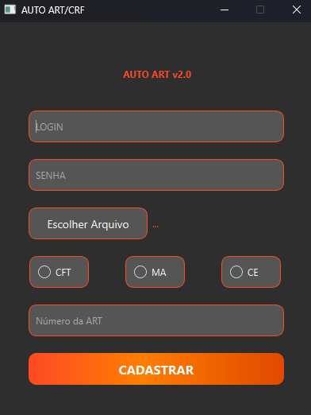

# 📝 Cadastro ART - Automação de Cadastro de ART's
Automação desenvolvida em Python para cadastro de ART's (Anotações de Responsabilidade Técnica) nos sistemas do CREA-CE e CREA-MA.



## 🚀 Funcionalidades

- ✔️ Cadastro automatizado de ART's
- 🌐 Suporte aos sistemas:
  - CREA-CE (https://servicos-crea-ce.sitac.com.br)
  - CREA-MA (https://sistemas.crea-ma.gov.br)
- 🖥️ Interface gráfica com PyQt6
- 📊 Processamento de planilhas Excel
- 🔄 Gerenciamento automático de drivers
- 🏗️ Gerador de instalador Windows (.msi)

## 📦 Pré-requisitos

- Python 3.12+
- Google Chrome (versão compatível)
- Conta ativa no CREA
- Planilha Excel no formato especificado

## 🛠️ Instalação

1. Clone o repositório:

```bash
git clone https://github.com/seu-usuario/cadastro-art.git
```

2. Instale as Dependências:

```bash
cd cadastro-art
```

```bash
pip install pipenv
```

```bash
pipenv install
```

```bash
python -m webdriver_manager chrome
```

##▶️ Como Usar

```bash
python -m app.main
```

##🔧 Build e Instalador

```bash
python setup.py build
```

```bash
heat dir "build/exe.win-amd64-3.12" -gg -sfrag -srd -dr INSTALLFOLDER -cg AutoArtFiles -var var.SourceDir -out AutoArtFiles.wxs
```

```bash
candle installer.wxs AutoArtFiles.wxs -dSourceDir="build/exe.win-amd64-3.12"
```

```bash
light installer.wixobj AutoArtFiles.wixobj -o installer.msi
```
