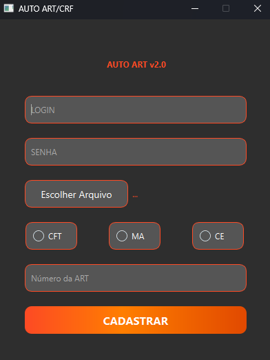

# 📝 Cadastro ART - Automação de Cadastro de ART's

Automação desenvolvida em Python para cadastro de ART's (Anotações de Responsabilidade Técnica) nos sistemas do CREA-CE e CREA-MA.



## 🚀 Funcionalidades

- ✔️ Cadastro automatizado de ART's
- 🌐 Suporte aos sistemas:
  - CREA-CE (https://servicos-crea-ce.sitac.com.br/index.php)
  - CREA-MA (https://servicos-crea-ma.sitac.com.br/index.php)
- 🖥️ Interface gráfica com PyQt6
- 📊 Processamento de planilhas Excel
- 🔄 Gerenciamento automático de drivers

## 📦 Pré-requisitos

- Python 3.12+
- Google Chrome (versão compatível)
- Conta ativa no CREA
- Planilha Excel no formato especificado

## 🛠️ Instalação

1. Clone o repositório:

```bash
git clone https://github.com/seu-usuario/cadastro-art.git
```

2. Instale as Dependências:

```bash
cd cadastro-art
```

```bash
pip install pipenv
```

```bash
pipenv install
```

```bash
python -m webdriver_manager chrome
```

## ▶️ Como Usar

```bash
python -m app.main
```

## 🔧 Gerando o Executável

Use sempre o ambiente virtual do projeto para garantir que o PyInstaller empacote as dependências corretas (Selenium, PyQt6, etc.).

1. Instale o PyInstaller no ambiente (se ainda não tiver):

```bash
pipenv install --dev pyinstaller
```

2. Gere o executável de uma destas formas:

**Opção A — com o shell do Pipenv ativo:**

```bash
pipenv shell
pyinstaller build.spec --noconfirm
```

**Opção B — sem entrar no shell:**

```bash
pipenv run pyinstaller build.spec --noconfirm
```

> A flag `--noconfirm` é opcional: evita a confirmação ao sobrescrever a pasta `dist/`.

O executável será gerado na pasta `dist/`:

| Sistema onde você builda | Arquivo gerado      |
|--------------------------|---------------------|
| macOS                    | `dist/auto_art_v2`  |
| Windows                  | `dist/auto_art_v2.exe` |

> O PyInstaller **não faz cross-compile**: para distribuir no Windows, o build precisa ser feito em uma máquina Windows.

## ☁️ Gerando o `.exe` no GitHub Actions (CI)

O workflow [`.github/workflows/build-windows.yml`](.github/workflows/build-windows.yml) gera `auto_art_v2.exe` em um runner `windows-latest`.

**Quando roda**

- Manualmente: Actions → **Build Windows EXE** → **Run workflow**
- Ao criar/publicar uma tag `v*` (ex.: `v1.2.0`)
- Ao publicar um GitHub Release

**Como baixar**

1. Abra a execução do workflow em **Actions**
2. Em **Artifacts**, baixe `auto_art_v2-windows`
3. Em builds por tag, o `.exe` também é anexado ao Release correspondente

> Os artefatos ficam disponíveis por 14 dias. Para distribuição permanente, use uma tag/Release.
